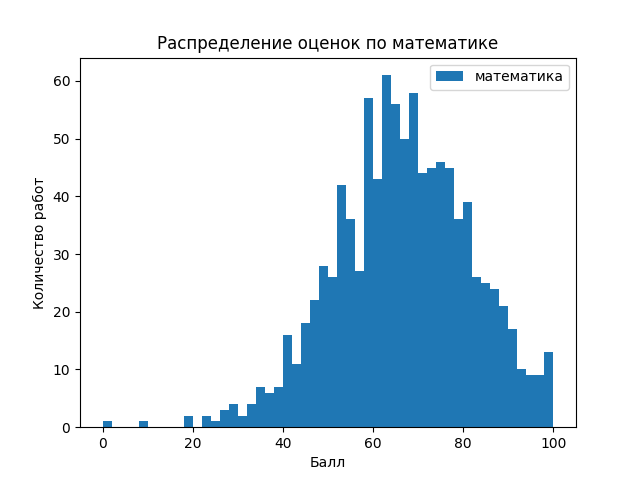
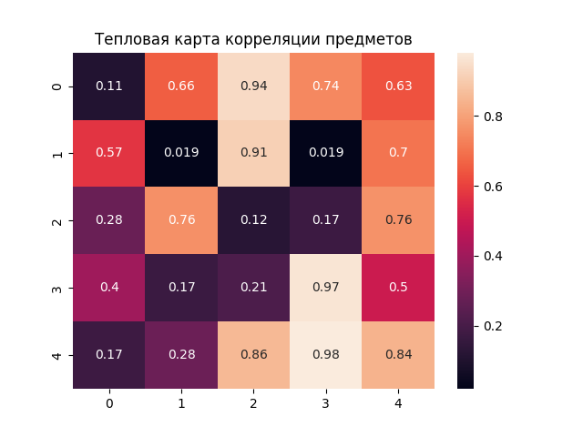
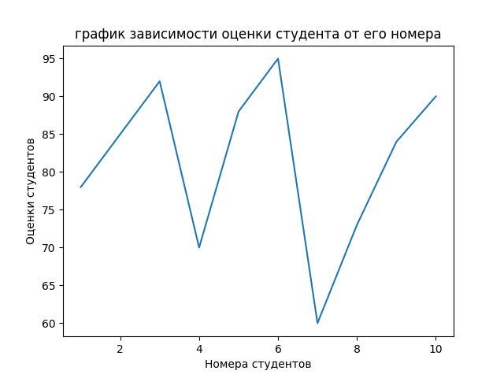
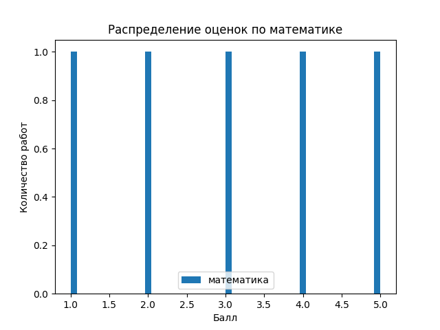
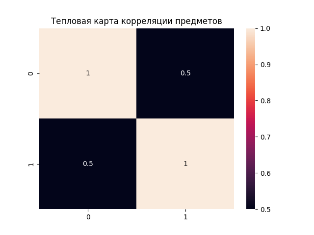
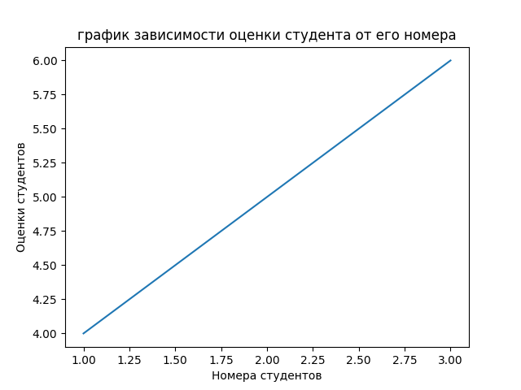

# Лабораторная работа №2: Основы NumPy: массивы и векторные операции

### Структура проекта:
```
numpy_lab/
├── main.py  # Реализация функций
├── test.py  # Юнит-тесты на pytest
├── data/    # Исходные данные
│   └── students_scores.csv  
│   └── StudentsPerformance.csv
└── plots/   # Папка для сохранения графиков
```

### Реализованные функции

**1. Работа с массивами: создание, преобразование, базовые операции**

create_vector: Создать вектор [0, 1, ..., 9].

create_matrix: Создать матрицу 5×5 со случайными числами.

reshape_vector: Преобразовать (10,) → (2, 5).

transpose_matrix: Реализовать транспонирование матрицы.

_Реализация:_
```python
def create_vector() -> np.ndarray:
    return np.arange(0, 10)

def create_matrix() -> np.ndarray:
    return np.random.rand(5, 5)

def reshape_vector(vec: np.ndarray) -> np.ndarray:
    return vec.reshape(2, 5)

def transpose_matrix(mat: np.ndarray) -> np.ndarray:
    return np.transpose(mat)
```

**2. Векторные операции**

vector_add: Реализовать сложение векторов одинаковой длины 

scalar_multiply: Реализовать умножение вектора на число 

elementwise_multiply: Реализовать поэлементное умножение 

dot_product: Реализовать скалярное произведение

_Реализация:_
```python
def vector_add(a: np.ndarray, b: np.ndarray) -> np.ndarray:
    return a + b  

def scalar_multiply(vec: np.ndarray, scalar: int | float) -> np.ndarray:
    return vec * scalar

def elementwise_multiply(a: np.ndarray, b: np.ndarray) -> np.ndarray:
    return a * b

def dot_product(a: np.ndarray, b: np.ndarray) -> int | float:
    return np.dot(a, b)  
```

**3. Матричные операции** 

matrix_multiply: Реализовать умножение матриц.

matrix_determinant: Реализовать нахождение определителя матрицы.

matrix_inverse: Реализовать нахождение обратной матрицы.

solve_linear_system: Реализовать решение линейной системы.

_Реализация:_
```python
def matrix_multiply(a: np.ndarray, b: np.ndarray) -> np.ndarray:
    return np.matmul(a, b)

def matrix_determinant(a: np.ndarray) -> float:
    return np.linalg.det(a)

def matrix_inverse(a: np.ndarray) -> np.ndarray:
    return np.linalg.inv(a)

def solve_linear_system(a: np.ndarray, b: np.ndarray) -> np.ndarray:
    return np.linalg.solve(a, b)
```

**4. Статистический анализ**

load_dataset: Загрузить CSV и вернуть NumPy массив.

statistical_analysis: Используя данные, нужно оценить: 
средний балл, медиану, стандартное отклонение, минимум, максимум, 25 и 75 перцентили.

normalize_data: Реализовать Min-Max нормализацию.

_Реализация:_
```python
def load_dataset(path: str ="data/students_scores.csv") -> np.ndarray:
    return pd.read_csv(path).to_numpy()

def statistical_analysis(data: np.ndarray) -> dict:
    stats = {}

    mean = np.mean(data)
    median = np.median(data)
    std = np.std(data)
    minimum = np.min(data)
    maximum = np.max(data)
    percentile_25 = np.percentile(data, 25)
    percentile_75 = np.percentile(data, 75)

    stats.update({"mean": mean, "median": median, "std": std, "min": minimum, "max": maximum,
                    "percentile_25": percentile_25, "percentile_75": percentile_75})

    return stats

def normalize_data(data: np.ndarray) -> np.ndarray:
    minimum = np.min(data)
    maximum = np.max(data)

    normalized_data = (data - minimum) / (maximum - minimum)

    return normalized_data
```


**5. Визуализация данных**

plot_histogram: Построить гистограмму распределения оценок по математике.

plot_heatmap: Построить тепловую карту корреляции предметов.

plot_line: Построить график зависимости: студент -> оценка по математике.

_Реализация:_
```python
def plot_histogram(data: np.ndarray) -> None:
    plt.hist(data, bins=50, label="математика")
    plt.title("Распределение оценок по математике")
    plt.xlabel("Балл")
    plt.ylabel("Количество работ")
    plt.legend()
    plt.savefig("plots/histogram.png")
    plt.show()

def plot_heatmap(matrix: np.ndarray) -> None:
    sns.heatmap(matrix, annot=True)
    plt.title("Тепловая карта корреляции предметов")
    plt.savefig("plots/heatmap.png")
    plt.show()

def plot_line(x: np.ndarray, y: np.ndarray) -> None:
    plt.plot(x, y)
    plt.title("график зависимости оценки студента от его номера")
    plt.xlabel("Номера студентов")
    plt.ylabel("Оценки студентов")
    plt.savefig("plots/line.png")
    plt.show()
```

### **Результаты построения графиков:**








## **Результаты тестирования:**

```bash
=============================================================================== test session starts ===============================================================================
platform win32 -- Python 3.13.9, pytest-9.0.2, pluggy-1.6.0 -- C:\Users\User\Documents\GitHub\igninsan.github.io\.venv\Scripts\python.exe
cachedir: .pytest_cache
rootdir: C:\Users\User\Documents\GitHub\igninsan.github.io\code\numpy_lab
collected 17 items

test.py::test_create_vector PASSED                                                                                                                                           [  5%]
test.py::test_create_matrix PASSED                                                                                                                                           [ 11%]
test.py::test_reshape_vector PASSED                                                                                                                                          [ 17%]
test.py::test_vector_add PASSED                                                                                                                                              [ 23%]
test.py::test_scalar_multiply PASSED                                                                                                                                         [ 29%]
test.py::test_elementwise_multiply PASSED                                                                                                                                    [ 35%]
test.py::test_dot_product PASSED                                                                                                                                             [ 41%]
test.py::test_matrix_multiply PASSED                                                                                                                                         [ 47%]
test.py::test_matrix_determinant PASSED                                                                                                                                      [ 52%]
test.py::test_matrix_inverse PASSED                                                                                                                                          [ 58%]
test.py::test_solve_linear_system PASSED                                                                                                                                     [ 64%]
test.py::test_load_dataset PASSED                                                                                                                                            [ 70%]
test.py::test_statistical_analysis PASSED                                                                                                                                    [ 76%]
test.py::test_normalization PASSED                                                                                                                                           [ 82%]
test.py::test_plot_histogram PASSED                                                                                                                                          [ 88%]
test.py::test_plot_heatmap PASSED                                                                                                                                            [ 94%]
test.py::test_plot_line PASSED                                                                                                                                               [100%]

=============================================================================== 17 passed in 3.91s ================================================================================

```

### Графики, полученные во время тестов:







## **Выводы:**

### В ходе выполнения лабораторной работы:

- Освоены основы работы с библиотекой NumPy 
и построения графиков с помощью matplotlib и seaborn.
- Реализованы операции с векторами и матрицами.
